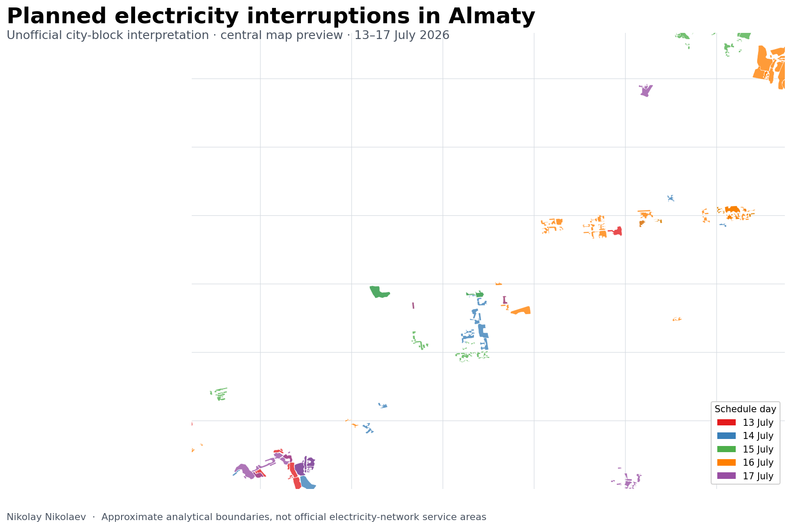

# Almaty Planned Electricity Outages Map

An unofficial interactive map of planned electricity interruptions in Almaty for **13–17 July 2026**.

**Live map:** [blue-dream-6827.fdas201290.workers.dev](https://blue-dream-6827.fdas201290.workers.dev/)

[](https://blue-dream-6827.fdas201290.workers.dev/)

## What the project does

The electricity provider published the schedule as a long address-based notice. This project converts the notice into a chronological spatial interface and associates each schedule entry with approximate urban-block polygons.

The published layer contains:

- **61** consolidated schedule records;
- **447** displayed block polygons;
- filters for each day and for the complete period;
- the source address, time, network district, equipment and work type;
- visible confidence markings for uncertain spatial matches.

The website is a standalone static page. The final GeoJSON is embedded directly in `index.html`, so Cloudflare, GitHub Pages or another static host can serve it without a database or application server.

## Method

The source schedule does not contain official outage-area geometry. Street names, address ranges and neighbourhood names were normalized and matched against OpenStreetMap-derived address evidence. Matched buildings were used only as location seeds; the displayed features are approximate block envelopes rather than individual building footprints.

The full methodology and confidence rules are documented in [`docs/methodology.md`](docs/methodology.md). Record-level matching evidence is available in [`data/matching_audit.csv`](data/matching_audit.csv).

## Repository contents

```text
.
├── index.html                       # deployable standalone map
├── data/
│   ├── outage_city_blocks.geojson  # final analytical block layer
│   ├── outage_records.csv          # normalized source schedule
│   └── matching_audit.csv          # record-level matching audit
├── docs/
│   ├── methodology.md
│   ├── qa-report.md
│   └── preview.png
├── scripts/
│   ├── build_site.py               # rebuilds index.html from repository data
│   └── validate_data.py            # consistency checks
├── site/index.template.html
├── ATTRIBUTION.md
├── DATA_LICENSE.md
└── LICENSE
```

## Rebuild and validate

Python 3.10 or newer is sufficient; the included scripts use only the standard library.

```bash
python scripts/validate_data.py
python scripts/build_site.py
python -m http.server 8000
```

Then open `http://localhost:8000/`. An internet connection is required for the Leaflet CDN files and OpenStreetMap background tiles.

## Disclaimer

**This is an unofficial analytical visualization.** It is not affiliated with АО «АЖК», the Almaty akimat or any utility organization.

The mapped polygons are approximate interpretations of published addresses. They are not official electricity-network, transformer, feeder or service-area boundaries. Check the original АЖК publication before relying on an address or interruption time.

## Author

**Nikolay Nikolaev**

- [LinkedIn](https://www.linkedin.com/in/ninikolaev/)
- [GitHub](https://github.com/njuorju)

## Sources and licensing

The interruption schedule is attributed to АО «Алатау Жарық Компаниясы» (АЖК). Geographic data and derived geometry use OpenStreetMap data and retain attribution to OpenStreetMap contributors.

Original project code and documentation are released under the MIT License. Third-party and geographic data terms are described separately in [`ATTRIBUTION.md`](ATTRIBUTION.md) and [`DATA_LICENSE.md`](DATA_LICENSE.md).

---

## Кратко по-русски

Неофициальная интерактивная карта плановых отключений электроэнергии в Алматы на 13–17 июля 2026 года. Текстовый график АЖК преобразован в хронологическую карту с приблизительными полигонами городских кварталов. Границы являются аналитической интерпретацией адресов и не отражают официальную конфигурацию электросетей или фактические зоны отключения.
